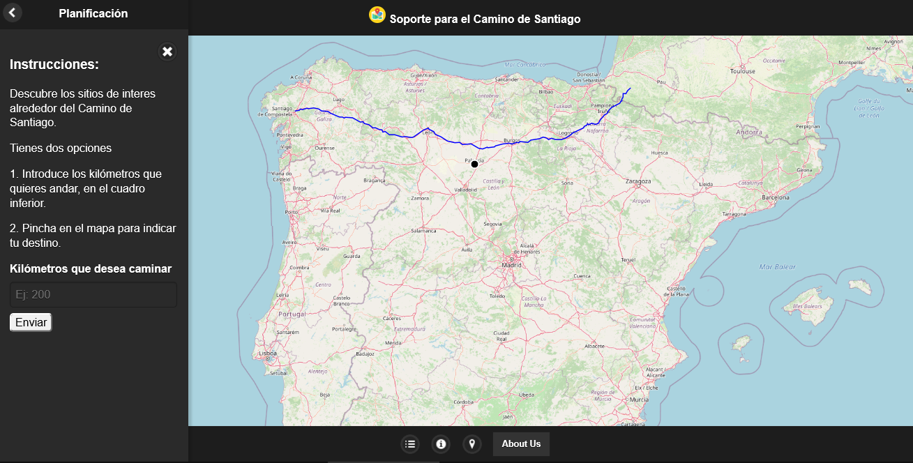
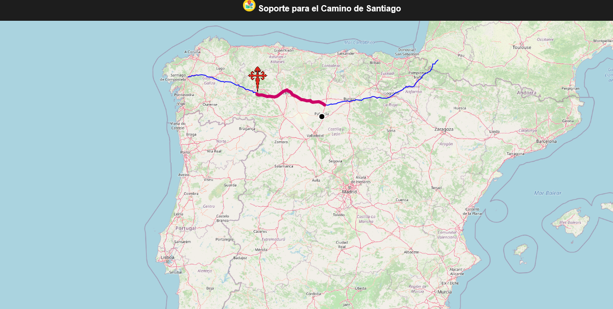
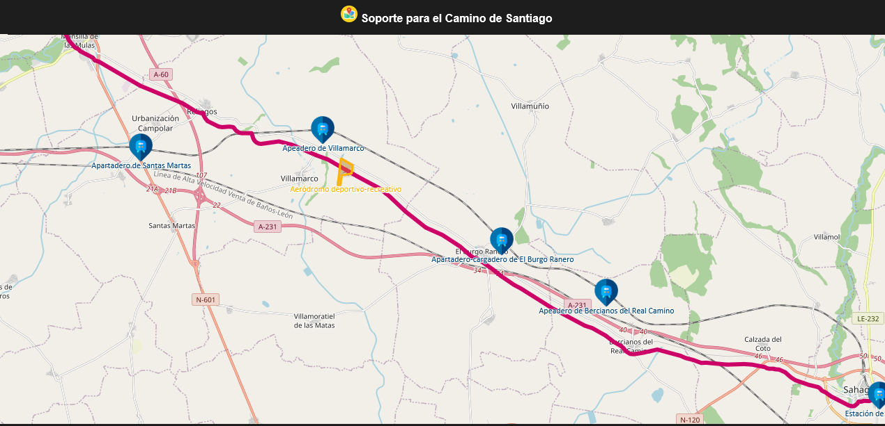

# APLICACIÓN DE SOPORTE DEL CAMINO DE SANTIAGO

## Descripción
Esta aplicación permitirá a los peregrinos del Camino de Santiago conocer los puntos más relevantes que se encuentran a su alrededor, así como planificar una ruta para días futuros en base a los mismos. Estos puntos de referencia pueden ser: hidrográficos, de interés cultural, de transporte y de alojamiento. Para ello, el usuario deberá introducir su próximo destino y la aplicación mostrará el camino a seguir junto con los puntos de interés alrededor de la misma.

## Caso de Uso
Caso de uso:

1. El usuario seleccionará el siguiente destino en su Camino.
2. Se buscará el punto del vector de la ruta más cercano a la ubicación del usuario. Y se definirá este nuevo punto como origen de la ruta.
3. Si el destino introducido no perteneciera al camino de Santiago, se considera como destino el punto del camino más cercano al destino introducido.
4. Se definirá un recorrido siguiendo el vector entre los puntos origen y destino.
5. Se buscará los puntos de interés: hidrográficos, de transporte, monumentos,... a 30km del recorrido.
6. Se mostrará la información por pantalla.

## Datos IDE empleados

- Hidrografía de España
- Red de Transporte Ferroviario de Adif
- GeoServer (capa con el Camino de Santiago almacenada en local)

## Technology Stack

- HTML
- JavaScript
- JQuery
- OpenLayers
- GeoServer
- PostgreSQL
- Jetty
- Servidores IDEE

## Muestras de uso

## Estructura

- binaries : resultados binarios del proyecto si los hubiera.
- app : código fuente html y javascript para el cliente del proyecto.
- database : scripts sql para la creación del esquema de base de datos. Debe incluir la creación de las tablas y la carga de los datos iniciales. Los scripts deben identificarse por separado para distinguir los que son parte de los prototipos iniciales y los que son definitivos.
- docs : carpeta para otros documentos explicativos, instrucciones de instalación, etc.
- geoserver : carpeta de configuración de geoserver con los workspaces y otros ficheros del catálogo de Geoserver.
- server : scripts de servidor como por ejemplo los PHP.

## Conclusiones y líneas de trabajo futuro
Este proyecto recoge el uso de todas las tecnologías vistas en la asignatura de IDEs:

- **Realización de operaciones espaciales**:  Calcula la ruta que debe seguir el usuario y muestra los puntos de interés que ha seleccionado.
- **Emplea servicios OGC**: Hace uso de servidores externos gestionados por la entidad competente para obtener información relevante para el usuario.

No obstante, aún quedan líneas de mejora interesantes que podrían aportar mucho valor a la aplicación:

1. Incluir más puntos de interés. 
2. Ofrecer valoraciones de los sitios de interés
3. Añadir más variantes del Camino de Santiago.
4. Compartir la ruta en redes sociales.
5. Seguimiento de la actividad en tiempo real. 
6. Seguimiento diario de la actividad.
7. Chat con usuarios de la aplicación cercanos a tu ubicación.

## Autores
Este proyecto ha sido desarrollado por @juacas , @danielconcab , @GonzaloBlanco7 , @javiermunooz y @alberbeni en 2020.
>>>>>>> 4b775131fa0df3679fe9bc7b4f85bd2f585637e9
